# 🚀 Next.js GitHub Actions CI/CD Best Practices

[](https://docs.github.com/en/actions)
[](https://nextjs.org/)
[](https://yarnpkg.com/)
[](https://www.typescriptlang.org/)
[](https://github.com/aquasecurity/trivy)

> A comprehensive GitHub Actions CI/CD pipeline demonstrating enterprise-grade best practices for Next.js frontend applications with automated versioning, security scanning, and static site deployment. The pipeline consists of two separate workflows: Pull Request validation and Main branch deployment.

## 📋 Table of Contents

- [🔧 Prerequisites](#-prerequisites)
- [🚀 Getting Started](#-getting-started)
- [⚙️ Configuration](#️-configuration)
- [✅ Next Steps](#-next-steps)
- [🏗️ Pipeline Architecture](#️-pipeline-architecture)
- [🔄 Pipeline Workflows](#-pipeline-workflows)
- [📊 Generated Reports and Artifacts](#-generated-reports-and-artifacts)
- [📦 Release Assets (Main Branch Only)](#-release-assets-main-branch-only)
- [🌿 Branch Strategy](#-branch-strategy)
- [📦 Versioning Strategy](#-versioning-strategy)
- [🆘 Troubleshooting](#-troubleshooting)
- [✨ Features](#-features)
- [🔒 Security Features](#-security-features)
- [📁 Project Structure](#-project-structure)
- [🏷️ Environment Variables](#️-environment-variables)
- [🔧 Custom Actions](#-custom-actions)
- [📚 Best Practices Implemented](#-best-practices-implemented)

---

## 🔧 Prerequisites

Before getting started, ensure you have the following installed and configured:

- **Node.js** with **Yarn 4+** package manager
- **GitHub** account with repository access
- Basic understanding of CI/CD concepts
- Your Next.js application initialized and ready

## 🚀 Getting Started

### 1. Repository Setup

```bash
# Clone the repository
git clone https://gitlab.nixdev.co/github_ci/nodejs-bestpractice-ci-frontend-github.git temp_repo_name

```

### 2. Copy the CI/CD Configuration

Navigate to your project root directory and run the following commands:

```bash
# Copy the GitHub Actions configuration to your project
cp -r /path/to/temp_repo_name/.github .

# Install dependencies
corepack enable
corepack prepare yarn@4 --activate
yarn install

```

### 3: Configure Yarn for CI Cache

Create or update your `.yarnrc.yml` file in the project root with the following configuration:

```yaml
enableGlobalCache: false
yarnPath: .yarn/releases/yarn-4.9.2.cjs
```

This setting optimizes caching behavior in CI environments.

### 4: Configure GitHub Secrets and Variables

Set up the following in your GitHub repository settings:

- **Secrets**:
  - `GITHUB_TOKEN` - **Automatically provided by GitHub Actions** (no need to create manually)

- **Variables**:
  - `PACKAGE_NAME` (optional) - Custom name for build artifacts (defaults to "frontend")

### 5: Push Code to Remote

```bash
git add .
git commit -m "Add GitHub Actions CI/CD pipeline"
git push origin main
```

### 6: Set Up Branch Protection and Approval Flow

To ensure code quality and security, protect the main branch with approval requirements.

1. Go to your repository's **Settings** tab.
2. Click **Branches** in the left sidebar.
3. If you see "Classic branch protections have not been configured", choose one of the options:
   - Click **Add classic branch protection rule** for the traditional method.
   - Or click **Add branch ruleset** for the new rules-based approach (recommended for advanced features).
   
   For this guide, we'll use the classic method: Click **Add classic branch protection rule**.
4. In "Branch name pattern", enter `main`.
5. Check the following options:
   - **Require a pull request before merging**
     - Require approvals: Check, set to 1
     - Dismiss stale pull request approvals when new commits are pushed: Check
     - Require review from Code Owners: Optional
     - Restrict who can dismiss pull request reviews: Check, select maintainers/owners
   - **Require status checks to pass before merging**: Check, add the following required checks:
     - `validate_branch_name`
     - `validate_version_bump`
     - `lint`
     - `format_check_new`
     - `typecheck`
     - `unit_test`
     - `yarn_audit`
     - `semgrep_scan`
     - `gitleaks_scan`
     - `validate_build`
   - **Include administrators**: Uncheck if you want to enforce for owners too
   - **Restrict pushes that create matching branches**: Optional (leave unchecked to allow branch creation)
   - **Allow force pushes**: Uncheck
   - **Allow deletions**: Uncheck
   
   Leave other options (like Require conversation resolution, Require signed commits, Require linear history, etc.) unchecked unless needed for your workflow.
6. Click **Create** or **Save changes**.

This prevents direct pushes to main, requiring all changes to go through pull requests with approval from at least 1 maintainer or owner, and passing all validation checks, tests, and security scans.

**Note**: Release artifacts and GitHub releases are created only on push to main after PR approval/merge.

---

## ⚙️ Configuration

### Package.json Scripts

```json
{ 
  "name": "{project name}",
  "version": "0.1.0",
  "scripts": {
    "dev": "next dev",
    "build": "next build",
    "export": "next export",
    "lint": "next lint",
    "format": "prettier --check .",
    "typecheck": "tsc --noEmit",
    "test": "jest"
  }
}
```

### Next.js Configuration (next.config.ts)

```typescript
import type { NextConfig } from "next";

const nextConfig: NextConfig = {
  output: "export",
  trailingSlash: true,
  images: {
    unoptimized: true,
  },
};

export default nextConfig;
```

## ✅ Next Steps

After completing the setup:

1. **Verify Pipeline**: Check your GitHub repository's Actions tab
2. **Configure Variables**: Set up necessary environment variables in GitHub
3. **Test Deployment**: Push a commit to trigger your first pipeline run
4. **Monitor Results**: Review pipeline logs and deployment status

---


## 🏗️ Pipeline Architecture

The CI/CD pipeline is split into **two separate workflows** for optimal performance and security:

### 📋 Workflow Files Structure

```
.github/workflows/
├── .github-ci-pull.yml    # Pull Request validation workflow
└── .github-ci-push.yml    # Main branch deployment workflow
```

### 🔄 Pipeline Flow Overview

```mermaid
graph TB
    A[🌿 Pull Request] --> B["📋 PR Pipeline"]
    C[🚀 Push to Main] --> D["🚀 Push Pipeline"]

    subgraph B ["Pull Request Pipeline (.github-ci-pull.yml)"]
        direction TB
        
        subgraph B1 ["🔍 Validation (Parallel)"]
            BP1[validate_branch_name]
            BP2[validate_version_bump] 
        end
        
        B4[install_dependencies]
        
        subgraph B2 ["✨ Code Quality (Parallel)"]
            BQ1[lint] 
            BQ2[format_check_new]
            BQ3[typecheck]
        end
        
        B5[unit_test]
        
        subgraph B3 ["🛡️ Security Scanning (Parallel)"]
            BS1[yarn_audit]
            BS2[semgrep_scan]
            BS3[gitleaks_scan]
        end
        
        B6[validate_build]
        B7[📝 Build validated but NO release created]
        
        B1 --> B4
        B4 --> B2
        B2 --> B5
        B5 --> B3
        B3 --> B6
        B6 --> B7
    end

    subgraph D ["Push Pipeline (.github-ci-push.yml)"]
        direction TB
        
        D1[extract_version]
        D2[tag_release]
        D3[install_dependencies]
        
        subgraph D4 ["✨ Code Quality (Parallel)"]
            DQ1[lint]
            DQ2[format_check_new]
            DQ3[typecheck]
        end
        
        D5[unit_test]
        
        subgraph D6 ["🛡️ Security Scanning (Parallel)"]
            DS1[yarn_audit]
            DS2[semgrep_scan] 
            DS3[gitleaks_scan]
        end
        
        D7[build_and_upload_frontend]
        D8[📝 Static assets built & GitHub release created]
        
        D1 --> D2
        D2 --> D3
        D3 --> D4
        D4 --> D5
        D5 --> D6
        D6 --> D7
        D7 --> D8
    end

    classDef validationStyle fill:#fff3e0,stroke:#ff9800,stroke-width:2px
    classDef qualityStyle fill:#e8f5e8,stroke:#4caf50,stroke-width:2px
    classDef securityStyle fill:#ffebee,stroke:#f44336,stroke-width:2px
    classDef pipelineStyle fill:#e3f2fd,stroke:#2196f3,stroke-width:2px
    
    class B1,D1,D2 validationStyle
    class B2,D4 qualityStyle
    class B3,D6 securityStyle
    class B,D pipelineStyle
```



### 🎯 Workflow Differences

| Aspect | Pull Request Workflow | Main Branch Workflow |
|--------|----------------------|---------------------|
| **Purpose** | Code validation & quality checks | Release deployment |
| **Triggers** | `pull_request` to `main` | `push` to `main` |
| **Branch Validation** | ✅ Enforces naming conventions | ❌ Not needed |
| **Version Bump** | ✅ Validates semantic versioning | ❌ Not needed |
| **Tagging** | ❌ No tag creation | ✅ Creates git tags |
| **Build Artifacts** | ✅ Validates build only | ✅ Creates and uploads artifacts |
| **GitHub Releases** | ❌ No release creation | ✅ Creates GitHub releases |
| **Permissions** | Read-only | `contents: write` |

## 🔄 Pipeline Workflows

### 🔍 Pull Request Workflow (`.github-ci-pull.yml`)

Validates code quality and security on every pull request to `main` branch:

| Job | Dependencies | Purpose | Execution |
|-----|-------------|---------|-----------|
| `validate_branch_name` | None | Enforces `feature/*` and `fix/*` naming conventions | Parallel |
| `validate_version_bump` | None | Validates semantic versioning based on branch type | Parallel |
| `install_dependencies` | `validate_branch_name`, `validate_version_bump` | Yarn 4 installation with caching | Sequential |
| `lint` | `install_dependencies` | ESLint code linting | Parallel |
| `format_check_new` | `install_dependencies` | Prettier formatting check | Parallel |
| `typecheck` | `install_dependencies` | TypeScript type checking | Parallel |
| `unit_test` | `lint`, `format_check_new`, `typecheck` | Jest unit test execution | Sequential |
| `yarn_audit` | `unit_test` | Yarn audit for vulnerabilities | Parallel |
| `semgrep_scan` | `unit_test` | SAST analysis with OWASP rules | Parallel |
| `gitleaks_scan` | `unit_test` | Secret detection scanning | Parallel |
| `validate_build` | `yarn_audit`, `semgrep_scan`, `gitleaks_scan` | Validates Next.js build (no artifacts) | Sequential |

### 🚀 Main Branch Workflow (`.github-ci-push.yml`)

Deploys to production after successful PR merge:

| Job | Dependencies | Purpose | Execution |
|-----|-------------|---------|-----------|
| `extract_version` | None | Extract version from package.json | First |
| `tag_release` | `extract_version` | Creates and pushes git tags | Sequential |
| `install_dependencies` | `tag_release` | Yarn 4 installation with caching | Sequential |
| `lint` | `install_dependencies` | ESLint code linting | Parallel |
| `format_check_new` | `install_dependencies` | Prettier formatting check | Parallel |
| `typecheck` | `install_dependencies` | TypeScript type checking | Parallel |
| `unit_test` | `lint`, `format_check_new`, `typecheck` | Jest unit test execution | Sequential |
| `yarn_audit` | `unit_test` | Yarn audit for vulnerabilities | Parallel |
| `semgrep_scan` | `unit_test` | SAST analysis with OWASP rules | Parallel |
| `gitleaks_scan` | `unit_test` | Secret detection scanning | Parallel |
| `build_and_upload_frontend` | `yarn_audit`, `semgrep_scan`, `gitleaks_scan`, `tag_release`, `extract_version` | Builds, scans artifacts, creates GitHub release | Final |

## 📊 Generated Reports and Artifacts

The pipeline generates several reports and artifacts for monitoring, debugging, and compliance. These are uploaded to GitHub Actions and can be downloaded from the workflow run page.

### 📈 Available Artifacts

| Artifact Name          | Generated By          | Format   | Purpose                                                                 | Retention |
|------------------------|-----------------------|----------|-------------------------------------------------------------------------|-----------|
| `yarn-audit-report`    | `yarn_audit`          | JSON     | Dependency vulnerability report from Yarn audit                         | 2 days   |
| `semgrep-report`       | `semgrep_scan`        | JSON     | Static Application Security Testing (SAST) results with OWASP Top 10   | 2 days   |
| `gitleaks-report`      | `gitleaks_scan`       | JSON     | Secret detection report from GitLeaks                                   | 2 days   |
| `unit-test-report`     | `unit_test`           | XML      | Unit test results in JUnit format                                       | 2 days   |
| `trivy-fs-report`      | `build_and_upload_frontend` | SARIF | Build artifact vulnerability scan results                               | 2 days   |

### 📋 How to Access Artifacts

1. **Go to GitHub Actions**: Navigate to your repository's **Actions** tab
2. **Select Workflow Run**: Click on the specific workflow run
3. **Download Artifacts**: In the "Artifacts" section at the bottom, click to download any report
4. **View in GitHub**: SARIF reports (Trivy) are also viewable directly in GitHub's Security tab under "Code scanning alerts"

### 🔍 Report Details

- **Yarn Audit Report** (`yarn-audit-report.json`):
  - Lists critical dependency vulnerabilities
  - Includes severity levels and fix recommendations
  - Use for dependency security monitoring

- **Semgrep SAST Report** (`semgrep-SAST.json`):
  - OWASP Top 10 security findings
  - Code quality and security issues
  - Helps identify potential vulnerabilities in source code

- **GitLeaks Report** (`gitleaks-report.json`):
  - Detected secrets and sensitive data leaks
  - Commit history analysis results
  - Critical for preventing credential exposure

- **Unit Test Report** (`junit.xml`):
  - Test execution results
  - Pass/fail statistics
  - Can be integrated with test dashboards

- **Trivy FS Report** (`trivy-fs-results.sarif`):
  - Static build artifact vulnerabilities
  - HIGH and CRITICAL severity findings
  - Integrates with GitHub Security tab for alerts

### 💡 Usage Tips

- **Monitoring**: Regularly review reports for trends in vulnerabilities
- **CI/CD Integration**: Use reports to block deployments on critical issues
- **Compliance**: SARIF reports integrate with GitHub's security features
- **Debugging**: Download artifacts to analyze failed pipeline runs

### 📦 Release Assets (Main Branch Only)

After a successful push to `main` branch, the pipeline creates a **GitHub Release** with build artifacts:

#### 🔍 How to Find Release Assets

1. **Navigate to Releases**:
   - Go to your repository's main page
   - Click **"Releases"** on the right sidebar (or `/releases` URL)
   - Find the latest release tagged with your version (e.g., `v1.2.3`)

2. **Download Assets**:
   - Scroll down to **"Assets"** section in the release
   - Look for `{PACKAGE_NAME}-{VERSION}.tar.gz` (e.g., `frontend-1.2.3.tar.gz`)
   - Click to download the compressed build artifact

#### 📋 Asset Contents

The release asset contains your **static Next.js build**:
```bash
# Extract and view contents
tar -xzf frontend-1.2.3.tar.gz
ls -la
# Contains: _next/, index.html, 404.html, and other static files
```

#### 🚀 Deployment Ready

- **Static Files**: Ready for deployment to any static hosting service
- **CDN Compatible**: Works with GitHub Pages, Netlify, Vercel, CloudFlare Pages
- **Self-contained**: All assets and dependencies included
- **Version Tagged**: Clear versioning for rollbacks and tracking

## 🌿 Branch Strategy

### Naming Convention

```bash
✅ feature/user-authentication
✅ feature/api-optimization
✅ fix/memory-leak-issue
✅ fix/validation-bug

❌ bugfix/something
❌ feat/new-feature
❌ random-branch-name
```

### Version Bump Requirements

| Branch Type | Version Bump        | Example           |
| ----------- | ------------------- | ----------------- |
| `feature/*` | **Minor** increment | `1.2.3` → `1.3.0` |
| `fix/*`     | **Patch** increment | `1.2.3` → `1.2.4` |

## 📦 Versioning Strategy

The pipeline implements **Semantic Versioning (SemVer)** with automated validation:

```json
{
  "version": "1.2.3",
  "// ": "MAJOR.MINOR.PATCH"
}
```

- **MAJOR**: Breaking changes (for now we should use also `feature/*` branches)
- **MINOR**: New features (`feature/*` branches)
- **PATCH**: Bug fixes (`fix/*` branches)

## 🆘 Troubleshooting

If you encounter issues:

- Ensure all prerequisites are properly installed
- Verify GitHub repository permissions
- Check that required environment variables are configured
- Review pipeline logs for specific error messages

## ✨ Features

### 🎯 **Automated Workflows**

- **Smart Branch Validation** - Enforces `feature/*` and `fix/*` naming conventions
- **Semantic Versioning** - Automatic version bump validation based on branch type
- **Git Tagging** - Automated release tagging on main branch
- **Dependency Caching** - Intelligent Yarn 4 cache management

### 🛡️ **Security First**

- **Vulnerability Scanning** - Yarn audit for npm dependencies
- **Secret Detection** - GitLeaks integration for credential scanning
- **SAST Analysis** - Semgrep with OWASP Top 10 rules
- **Build Artifact Security** - Trivy scanning for built static files

### 🏗️ **Code Quality**

- **Linting** - ESLint integration with Next.js rules
- **Formatting** - Prettier code formatting validation
- **Type Safety** - TypeScript type checking
- **Testing** - Jest testing framework

### 📦 **Static Site Deployment**

- **Static Export** - Next.js static site generation
- **Artifact Archiving** - Automated build artifact creation
- **GitHub Releases** - Direct deployment to GitHub releases
- **Cross-platform** - Static files compatible with any hosting


## 🔒 Security Features

### 🔍 Multi-Layer Security Scanning

1. **Dependency Vulnerabilities**

   ```bash
   yarn npm audit --severity critical
   ```

2. **Static Application Security Testing**

   ```bash
   semgrep scan --config p/owasp-top-ten
   ```

3. **Secret Detection**

   ```bash
   gitleaks detect --exit-code 1
   ```

4. **Build Artifact Security**
   ```bash
   trivy fs --severity HIGH,CRITICAL
   ```

### 🛡️ Security Gates

- **Critical vulnerabilities** block pipeline progression
- **Secret leaks** prevent code commits
- **OWASP Top 10** compliance validation
- **Build artifact CVEs** scanning before release

## 📁 Project Structure

```
your-nextjs-project/
├── � .github/workflows/                # CI/CD Pipeline workflows
│   ├── .github-ci-pull.yml             # Pull request validation workflow
│   └── .github-ci-push.yml             # Main branch deployment workflow
├── 📁 .github/actions/                  # Custom GitHub Actions
│   ├── setup-node/action.yml           # Node.js setup action
│   └── code-quality/action.yml         # Code quality action
├── 📦 package.json                     # Dependencies & scripts
├── 🧶 yarn.lock                       # Dependency lock
├── ⚙️ .yarnrc.yml                     # Yarn configuration
├── 📝 next.config.ts                   # Next.js configuration
├── 🔍 eslint.config.mjs                # Linting rules
├── 💅 .prettierignore                  # Prettier ignore rules
├── 🧪 jest.config.ts                   # Jest configuration
├── 🧪 jest.setup.ts                    # Jest setup
├── 📁 src/                             # Source code
├── 🧪 __tests__/                       # Test files
└── 📖 README.md                        # This file
```


## 🏷️ Environment Variables

### Global Environment Variables

| Variable | Scope | Purpose | Default Value | Required |
|----------|-------|---------|---------------|----------|
| `PACKAGE_NAME` | Both workflows | Custom name for build artifacts | `"frontend"` | No |

### GitHub Provided Variables

| Variable | Scope | Purpose | Auto-provided |
|----------|-------|---------|---------------|
| `GITHUB_TOKEN` | Both workflows | GitHub API authentication | ✅ Yes (automatic) |
| `github.head_ref` | Pull Request workflow | Source branch name in PR | ✅ Yes |
| `github.ref` | Main workflow | Current branch reference | ✅ Yes |
| `github.event_name` | Both workflows | Event type (push, pull_request) | ✅ Yes |

### Job-Specific Variables

#### Pull Request Workflow
| Variable | Job | Purpose | Source |
|----------|-----|---------|--------|
| `BRANCH_NAME` | `validate_branch_name` | Branch naming validation | `${{ github.head_ref }}` |
| `BRANCH_NAME` | `validate_version_bump` | Version bump validation | `${{ github.head_ref }}` |

#### Main Branch Workflow
| Variable | Job | Purpose | Source |
|----------|-----|---------|--------|
| `VERSION` | `tag_release` | Version for git tagging | `${{ needs.extract_version.outputs.version }}` |
| `VERSION` | `build_and_upload_frontend` | Version for artifact naming | `${{ needs.extract_version.outputs.version }}` |

### 🔧 Configuration Notes

- **`GITHUB_TOKEN`**: Automatically provided by GitHub Actions with appropriate permissions
- **`PACKAGE_NAME`**: Can be customized in repository variables for different artifact naming
- **Version**: Extracted from `package.json` at runtime, no manual configuration needed
- **Permissions**: Main workflow requires `contents: write` for tagging and releases

## 🔧 Custom Actions

### Setup Node Action (.github/actions/setup-node/action.yml)

This composite action sets up Node.js 22, enables Corepack, prepares Yarn v4, and configures caching.

**Inputs:**
- `node-version` (default: '22'): Node.js version to install
- `yarn-version` (default: '4.9.2'): Yarn version to prepare

**Features:**
- Uses `actions/setup-node@v5` for Node.js installation
- Enables Corepack for Yarn management
- Prepares specified Yarn version
- Configures caching for Yarn dependencies (.yarn/, .pnp.cjs, .pnp.loader.mjs)

**Usage:**
```yaml
- name: Setup Node with Yarn
  uses: ./.github/actions/setup-node
  with:
    node-version: '22'
    yarn-version: '4.9.2'
```

### Code Quality Action (.github/actions/code-quality/action.yml)

This composite action sets up Node with Yarn and runs specified code quality commands.

**Inputs:**
- `command` (required): The yarn command to run (e.g., lint, format, typecheck)

**Features:**
- Calls the setup-node action for environment setup
- Runs the specified yarn command
- Supports linting, formatting, and type checking

**Usage:**
```yaml
- name: Run Lint
  uses: ./.github/actions/code-quality
  with:
    command: lint
```

## 📚 Best Practices Implemented

### ✅ **Dual Workflow Architecture**

- **Separation of Concerns** - Pull request validation vs production deployment
- **Optimized Performance** - Only necessary jobs run for each context
- **Security Isolation** - Different permission levels for validation vs deployment
- **Clear Responsibility** - Each workflow has a specific purpose and scope

### ✅ **Pipeline Optimization**

- **Smart Caching** - Yarn cache with lock file keys
- **Parallel Execution** - Jobs run in parallel when dependencies allow
- **Conditional Logic** - Different workflows for PR vs Main branch
- **Fail-Fast** - Early pipeline termination on critical issues
- **Resource Efficiency** - Optimized job dependencies and execution order

### ✅ **Security Best Practices**

- **Shift-Left Security** - Early vulnerability detection in PRs
- **Multi-layered Scanning** - Dependencies, code, secrets, build artifacts
- **Zero-Trust** - No security check bypassing
- **Automated Remediation** - Block merges and deployments on security issues
- **Token Security** - Automatic GitHub token provisioning

### ✅ **Code Quality Standards**

- **Consistent Formatting** - Prettier integration
- **Linting Rules** - ESLint with Next.js rules
- **Type Safety** - TypeScript strict mode
- **Test Coverage** - Jest testing framework
- **Branch Validation** - Naming convention enforcement

### ✅ **Static Site Best Practices**

- **Static Export** - Optimized for static hosting
- **Artifact Security** - Pre-deployment vulnerability scanning
- **Release Management** - Automated GitHub releases
- **Cross-platform Compatibility** - Static files work anywhere
- **Version Management** - Semantic versioning with automated tagging

### ✅ **Git Workflow**

- **Branch Protection** - PR-only merging with validation gates
- **Semantic Versioning** - Automated version management
- **Release Automation** - GitHub releases on main
- **Pull Request Gates** - Quality checks before merge
- **Tag Management** - Automated git tagging

---
